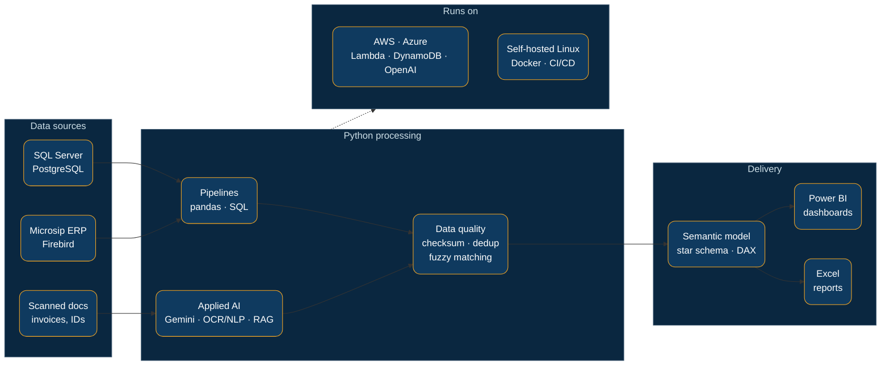

<picture>
  <source media="(prefers-color-scheme: dark)" srcset="themes/amber/banner-dark.svg">
  
</picture>

 

<picture></picture>

I'm a licensed actuary who moved into data. I build **end-to-end data solutions** — extracting and validating data, modeling it, and turning it into dashboards and reports people actually use. My background spans **banking, insurance, and consumer goods**, and my quantitative training leads me to treat every data point as something to validate against a source of truth: **reliable pipelines, not just results that look good.**

- Focus: Business Intelligence, data pipelines, and applied AI (LLMs / RAG)
- 1st place — **Capgemini & Microsoft Hackathon 2023** (Azure-hosted knowledge base behind a RAG)
- Engineering rigor: automated tests, static typing, clean documentation
- Spanish (native) · English (C1) · Open to Data Analyst / BI / Data Engineer roles — immediately available

 

**How I work**

 

<picture></picture>

<picture></picture>

<picture></picture>&nbsp;&nbsp;&nbsp;<picture></picture>&nbsp;&nbsp;&nbsp;<picture></picture>&nbsp;&nbsp;&nbsp;<picture></picture>

| Area | Tools |
|:--|:--|
| Languages & data | <kbd>Python</kbd> <kbd>SQL</kbd> <kbd>pandas</kbd> <kbd>Bash</kbd> |
| BI & visualization | <kbd>Power BI</kbd> <kbd>DAX</kbd> <kbd>Power Query</kbd> <kbd>MicroStrategy</kbd> <kbd>Excel / VBA</kbd> |
| Databases | <kbd>PostgreSQL</kbd> <kbd>SQL Server</kbd> <kbd>Firebird</kbd> <kbd>DynamoDB</kbd> |
| Cloud & applied AI | <kbd>AWS</kbd> <kbd>Azure</kbd> <kbd>LLMs / RAG</kbd> <kbd>OCR / NLP</kbd> |
| Tooling | <kbd>Git</kbd> <kbd>Docker</kbd> <kbd>Linux</kbd> <kbd>pytest</kbd> <kbd>mypy</kbd> <kbd>pydantic</kbd> |

 

<picture></picture>

**cxc-report-engine**
Python engine that audits **accounts-receivable (AR)** data from the Microsip ERP (Firebird) and generates collections reports in Excel, segmented by collector. Built with engineering rigor: modular architecture, **286 `pytest` tests, `mypy --strict`, and `pydantic` schemas** for validated data models.
<kbd>Python</kbd> <kbd>Firebird</kbd> <kbd>pandas</kbd> <kbd>pytest</kbd> <kbd>mypy</kbd> <kbd>pydantic</kbd>

**gemini-document-intelligence**
Document-intelligence pipeline built on the **Google Gemini API** that classified and processed an initial batch of ~6,000 scanned invoices — with hash-based deduplication (process only new documents) and an API spend cap to control cost.
<kbd>Python</kbd> <kbd>Gemini API</kbd> <kbd>OCR / NLP</kbd>

**collections-dashboard** &nbsp; *(in progress)*
A Power BI **collections dashboard managed as code**: version-controlled in **PBIP format with TMDL**, so the semantic model, table relationships, and DAX measures live as text files under source control — enabling diffs, review, and reproducibility for the data model itself.
<kbd>Power BI</kbd> <kbd>PBIP / TMDL</kbd> <kbd>DAX</kbd> <kbd>Data modeling</kbd>

**privasee-bi** &nbsp; *(in progress)*
Self-hosted analytics platform I'm building to explore a privacy-first BI stack.
<kbd>Flask</kbd> <kbd>Docker</kbd> <kbd>Python</kbd>

> [!NOTE]
> Some professional projects are covered by confidentiality and are described in my CV rather than published here.

 

<picture></picture>

- Oracle Cloud Infrastructure 2024 — **AI Foundations Associate** (2024)
- Microsoft Certified — **Azure Fundamentals (AZ-900)** (2024)
- IBM — **Applied Software Engineering Fundamentals** (2026)
- GitHub Foundations (Microsoft Learn path) · Power BI Data Analyst **(PL-300, in progress)**

 

<picture></picture>

  

&nbsp;
&nbsp;

  

